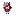

  

## 🌟 Public Projects

<!-- PROJECTS-LIST-START -->
| Project | Description | Language |
| :--- | :--- | :--- |
| [**qwenpaw-issue-3893-research**](https://github.com/CA-mambo/qwenpaw-issue-3893-research) | Deep dive, reproduction scripts, and root cause analysis for QwenPaw Issue #3893 (Context Sync Race Condition). | Python |
| [**qwenpaw-extensions**](https://github.com/CA-mambo/qwenpaw-extensions) | A collection of community-driven extensions and utilities for QwenPaw/Copaw. | PowerShell |
| [**agent-experiment**](https://github.com/CA-mambo/agent-experiment) | Experiments and Benchmarks for Multi-Agent Systems | Python |
<!-- PROJECTS-LIST-END -->

> 🌱 _This Garden grows with every commit. Check the `garden.svg` for a visual representation of my contribution heatmap!_

---

> 📖 **Maintainers:** For technical documentation and setup instructions, please read `another_readme.md`.
